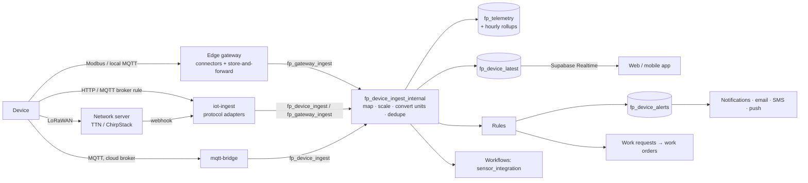
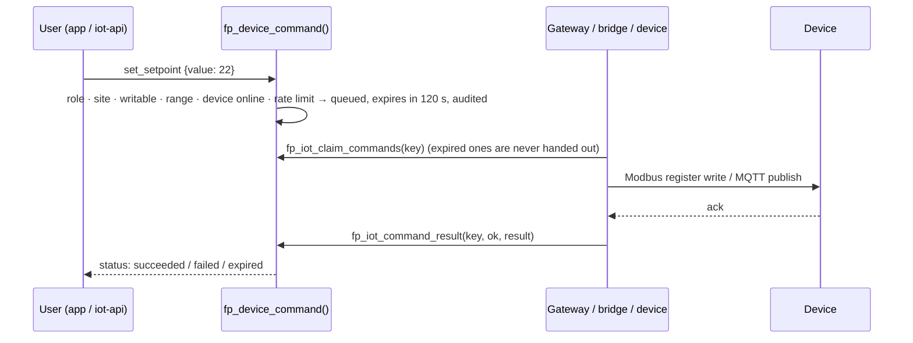

# FacilityPro universal IoT integration layer

FacilityPro is an FM platform with a universal IoT integration layer, not an app that talks to
IoT devices. The apps (web and mobile) only ever see **normalised** devices, metrics, units,
alerts and commands. Protocols and manufacturer specifics live in the integration layer:
protocol adapters, the edge gateway's connectors, and catalog data.

This document covers what is built (Phase 1: migration **0077** and the components below), how
it maps to the target architecture, and what comes next.

## 1. Architecture

```
                         FACILITYPRO
                              │
              ┌───────────────┴───────────────┐
           FM CORE                        IoT PLATFORM (0024 → 0077)
   CMMS · assets · work orders       device registry · catalog · data points
   inspections · vendors · staff     telemetry · latest values · alerts · rules
              │                      commands · gateways · history
              └───────────────┬───────────────┘
                     INTEGRATION LAYER
     ┌──────────────┬─────────┴────────┬──────────────────┐
  iot-ingest      fp_gateway_*      mqtt-bridge         iot-api /v1
  (HTTP adapters: RPCs (key-auth)   (cloud MQTT pull    (REST facade for
  JSON, MQTT rule,                   + commands)         apps & integrators)
  TTN, ChirpStack)
     │                  │                  │
  devices / brokers   EDGE GATEWAY (iot-gateway/, on site)
  / LoRaWAN network   connectors: Modbus TCP · Modbus RTU · MQTT (BACnet/OPC UA next)
  servers                    │
                   ┌─────────┼─────────┐
                 ENERGY     HVAC       IAQ / water / occupancy
                 METERS   EQUIPMENT    SENSORS
```

Data flow (device → app):



Commands (app → device):



The platform is Postgres-centric on purpose: every rule that protects tenants (RLS, role
checks, key checks) is enforced in one place, next to the data, and is covered by tests. The
"services" in the target architecture are modules of that core, not separate deployments.
They can be split out later without changing the data model or the apps.

## 2. Target components → implementation

| # | Component | Where |
|---|---|---|
| 1 | Device Management Service | `fp_devices` (+ 0077 columns), Devices pages, `iot-api /v1/devices` |
| 2 | Device Registry | `fp_devices`, `fp_device_directory` (key-free view with computed status) |
| 3 | Protocol Adapter Layer | `supabase/functions/_shared/iot-adapters.ts` (cloud), `iot-gateway/src/connectors/` (edge) |
| 4 | IoT Gateway Management | `fp_iot_gateways`, `fp_gateway_config` (heartbeat + config), Devices → Gateways |
| 5 | Telemetry Ingestion | `iot-ingest`, `fp_device_ingest`, `fp_gateway_ingest` → `fp_device_ingest_internal` |
| 6 | Data Normalisation | `fp_device_data_points`, `fp_iot_quantities`, `fp_iot_units`, `fp_iot_convert` |
| 7 | Device Command Service | `fp_device_commands`, `fp_device_command`, `fp_iot_claim_commands`, `fp_iot_command_result` |
| 8 | Rules & Automation | `fp_device_rules` (thresholds, AND-conditions, baseline deviation) + existing workflows (`sensor_integration`) |
| 9 | Device Health Monitoring | status in `fp_device_directory`; battery/RSSI/SNR metrics; firmware; offline alerts (0067); gateway heartbeat |
| 10 | Alert/Event Service | `fp_device_alerts` (severity, ack, resolve, escalation) → `fp_notifications` → email/SMS/push |
| 11 | Time-series storage | `fp_telemetry` (unique device/metric/ts) + `fp_telemetry_hourly` rollups; `fp_device_history` |
| 12 | IoT Analytics | `fp_device_history` (bucketed min/avg/max), baseline rules. Dashboards: roadmap |
| 13 | Integration/Connector Framework | `Connector` interface (`iot-gateway/src/connector.mjs`), adapter registry, catalog-driven models |
| 14 | Role-based device permissions | RLS + RPC checks (below) |
| 15 | Audit logging | `fp_audit` on devices, gateways, data points, alerts, commands (secrets never logged) |

## 3. Data model

Digital-twin path: **Organisation → Site → Building → Floor → Zone → Room → Asset → Device → Data points**.
Sites (`fp_sites`) are the campus/portfolio level; buildings, floors, zones and rooms are
`fp_locations` (0002); a device's `site_id` follows its location automatically.

| Spec entity | Table |
|---|---|
| tenants / organizations | `fp_organizations` (every IoT row carries `org_id`) |
| sites / buildings / floors / zones / rooms | `fp_sites`, `fp_locations` |
| assets | `fp_assets` (`fp_devices.asset_id`) |
| devices | `fp_devices` |
| device_models / manufacturers / types | `fp_iot_device_models`, `fp_iot_manufacturers`, `fp_iot_device_types` (global + per-org) |
| device_protocols | `fp_devices.protocol` (checked list) + `fp_iot_device_models.protocols` |
| device_connections | `fp_devices.connection_config` (non-secret), `fp_device_connections` (cloud MQTT pull) |
| device_credentials | `fp_device_credentials` (write-only via `fp_device_set_credentials`; service role reads) |
| data_points | `fp_device_data_points` |
| telemetry | `fp_telemetry`, `fp_telemetry_hourly`, `fp_device_latest` |
| device_events / device_alerts | `fp_device_alerts`; event messages arrive as readings with `meta.event` |
| iot_gateways | `fp_iot_gateways` |
| iot_connectors | code: `iot-gateway/src/connectors/*` + catalog models |
| iot_commands | `fp_device_commands` |
| automation_rules / actions | `fp_device_rules` (+ `fp_workflows` for multi-step automation) |
| maintenance_work_orders | `fp_requests` → `fp_work_orders` |
| audit_logs | `fp_audit_log` |

Indexes: telemetry `(device_id, metric, ts)` unique, `(org_id, ts)`, `(device_id, created_at)`;
devices `(org_id, site_id)`, `(org_id, location_id)`, `(org_id, lower(external_id))` unique,
`(gateway_id)`; alerts `(device_id, opened_at)`, `(org_id, status)` open, one unresolved per rule;
commands `(device_id, requested_at)`, `(gateway_id, status)` pending.

## 4. Devices, taxonomy and data points

- **Taxonomy** (`fp_iot_device_types`): energy, HVAC, water, environment, occupancy, safety,
  asset monitoring, gateway. 34 types seeded (electricity/power meters, CTs, T/RH, CO₂, DP,
  airflow, AHU/FCU, chiller, VRF, water/flow/level/leak/pressure, IAQ, PIR, mmWave, people
  counter, door, smoke/fire/emergency/access integrations, vibration, motor monitor). An org
  admin adds more rows; no code change.
- **Models** carry a data-point template (key → metric, unit, Modbus register) and named
  commands. Seeded: Schneider iEM3250 (register map), Milesight EM300-TH and AM307,
  Dragino LHT65, Daviteq WSLRW-ATH, generic MQTT sensor/thermostat and Modbus meter
  templates. Manufacturers seeded: Schneider Electric, Siemens, Daviteq, EPCB, Milesight,
  Dragino. **Verify register maps against the manual of the exact meter firmware before
  relying on them.**
- **Data points** map what the device sends (`key`) to a canonical `metric`, with source
  `unit`, `scale`/`offset`, protocol address in `source`, and `writable`, `dangerous`,
  `min`/`max` for control. Keys the platform receives but nobody mapped are recorded as
  **discovered** (max 200 per device) for an admin to map. A data point can be muted.

## 5. Normalisation

Every reading goes through `fp_device_ingest_internal`:

1. key → metric via the data point (or the key itself);
2. `value × scale + offset`;
3. unit → the metric's canonical unit via `fp_iot_units` (°F/K→°C, kW/MW→W, Wh/MWh→kWh,
   Pa/hPa/bar/psi→kPa, L/s, m³/h, gpm→L/min, L→m³, mA→A, kV→V…);
4. the raw reading is kept in `meta.raw`;
5. stored once per (device, metric, timestamp) (MQTT QoS 1 redelivery and gateway re-sends
   are harmless); future timestamps are clamped; 600 readings/device/minute max;
6. `fp_device_latest` is upserted (never overwritten by an older reading) → Realtime.

So a Daviteq, EPCB or Milesight temperature all arrive as `temperature` in `°C`.

## 6. Protocols

| Protocol | Phase | Status | Path |
|---|---|---|---|
| REST/HTTP | 1 | ✅ | device key → `iot-ingest` or `fp_device_ingest` |
| Webhooks | 1 | ✅ | `iot-ingest` (generic JSON, broker rules, network servers) |
| MQTT | 1 | ✅ | broker rule → `iot-ingest` (topic envelope); cloud pull → `mqtt-bridge`; on-site → gateway MQTT connector. Commands both ways. |
| Modbus TCP | 1 | ✅ | gateway `ModbusConnector` (register maps, batching, word order, all datatypes, writes) |
| Modbus RTU | 1 | ✅ | same connector over RS-485 (`serialport`, `WITH_SERIAL=true`) |
| LoRaWAN | 2 | ✅ uplinks | The Things Stack v3 / ChirpStack v4 webhooks → `iot-ingest` with a gateway key (DevEUI = `external_id`); RSSI/SNR/battery; AppKey stored as a device credential. Downlinks: roadmap |
| BACnet/IP | 2 | planned | gateway connector (discovery, ReadProperty/WriteProperty, COV) |
| WebSockets | 2 | ✅ to apps | Supabase Realtime pushes `fp_device_latest` to the apps |
| OPC UA | 2 | planned | gateway connector |
| BACnet MS/TP, KNX, Zigbee, vendor APIs | 3 | planned | gateway connectors / server-side connectors using `fp_device_credentials` |

The protocol list in `fp_devices.protocol` already accepts all of them, so a device can be
registered (and fed through a gateway or webhook) before its native connector exists.

### MQTT

Topic scheme (per the spec, with the product name):

```
facilitypro/{org_id}/{site_id | -}/{device external_id}/telemetry   device → platform
facilitypro/{org_id}/{site_id | -}/{device external_id}/state       retained state
facilitypro/{org_id}/{site_id | -}/{device external_id}/event       {"event":"leak","value":true}
facilitypro/{org_id}/{site_id | -}/{device external_id}/command     platform → device {id, type, data_point, value}
facilitypro/{org_id}/{site_id | -}/{device external_id}/command/ack device → platform {id, ok, result|error}
```

- **TLS** (`mqtts://` / `wss://`) on brokers; username/password per connection (cloud) or in
  the gateway's environment (on site).
- **Authorisation**: the org id is the topic prefix, so a shared broker can confine each
  tenant to `facilitypro/{its org}/#` with ACLs. The platform side authorises by device or
  gateway key, never by topic.
- **QoS 1** for telemetry and commands, persistent sessions on the gateway, reconnect every
  5 s. Duplicates are dropped by the (device, metric, ts) key. Payloads are validated (size,
  metric length, meta size).
- **Offline buffering** at the edge: the gateway's store-and-forward buffer (disk-backed).

### Modbus register maps

```json
{ "key": "voltage_l1", "metric": "voltage_l1", "unit": "V",
  "source": { "register_type": "holding", "address": 3028, "datatype": "float32",
              "word_order": "big", "one_based": true } }
```

`register_type`: holding · input · coil · discrete. `datatype`: bool, int16, uint16, int32,
uint32, float32, int64, uint64, float64. Adjacent registers are read in one request (≤120
registers). Links are pooled per TCP host or serial port and requests are serialised (several
meters behind one Modbus gateway or on one RS-485 bus).

## 7. Commands

- Requested only through `fp_device_command()`: a model command (`turn_on`, `set_setpoint`…)
  or `write` to a writable data point, or `request_status`.
- **Authorisation**: technicians may request status; writes need a manager; **dangerous**
  data points/commands need an org admin. Site-scoped roles apply.
- **Validation**: value within the data point's min/max; the device must have reported within
  its offline window: **no control based on stale state**; 30 commands/device/minute.
- **Expiry**: default 120 s (10 s to 1 h). An expired command is never handed out; the
  gateway re-checks expiry before executing; a job marks leftovers expired.
- **Audit**: every command row (who, when, what, outcome) is audited; statuses pending →
  sent → succeeded/failed/expired/cancelled; results and errors are kept.
- The app never queues commands offline (they're sent directly and fail without a
  connection), and the UI disables controls while the device isn't reporting.

## 8. Rules and alerts

- Operators `>`, `≥`, `<`, `≤`, `=`, `≠`, and **% above/below baseline** (the metric's 7-day
  average); up to 5 **AND-conditions** on the latest values of this or another device (e.g.
  CO₂ > 1000 ppm AND people_count > 20).
- Actions: alert only · notify · work order · both. One unresolved alert per rule; repeats
  increment its count; a work request is raised only when the alert opens; the alert
  **auto-resolves** when the value returns to normal.
- Severity **info · warning · critical · emergency**; recipients by role (admins, managers,
  optionally technicians); **working hours** and **suppression** windows for notifications
  (the alert is still recorded); **escalation** to org admins when not acknowledged within N
  minutes (job every 5 minutes); cooldown between repeat notifications.
- Staff acknowledge/resolve alerts in the app or via `iot-api`. Notifications go out by email,
  SMS and push through the existing outbox; WhatsApp/Zalo delivery is a planned action.
- Multi-step automation (webhook, escalations, assignments) uses the existing workflows engine,
  which already receives every reading as a `sensor_integration` event.

## 9. APIs

Apps use Supabase directly (PostgREST + RPCs under RLS) and Realtime for live data. For
integrators and scripts, the versioned facade `iot-api` exposes the same data under the
caller's own login:

| Spec endpoint | FacilityPro |
|---|---|
| `POST/GET /api/devices` | `POST/GET /functions/v1/iot-api/v1/devices` |
| `GET/PATCH/DELETE /api/devices/{id}` | `…/v1/devices/{id}` |
| `GET /api/devices/{id}/telemetry` | `…/v1/devices/{id}/telemetry` (raw) |
| `GET /api/devices/{id}/history` | `…/v1/devices/{id}/history` (bucketed) |
| `GET /api/devices/{id}/status` | `…/v1/devices/{id}/status` (status, health, latest) |
| `POST /api/devices/{id}/commands` | `…/v1/devices/{id}/commands` (+ `GET` history) |
| `GET /api/devices/{id}/alerts` | `…/v1/devices/{id}/alerts`; `POST …/v1/alerts/{id}/acknowledge\|resolve` |
| `GET/POST /api/connectors`, `POST …/test` | `GET …/v1/gateways`, `GET …/v1/catalog`; the connection test is the device's first reading / `request_status` |

Device-side (key-authenticated) RPCs: `fp_device_ingest`, `fp_gateway_ingest`,
`fp_gateway_config`, `fp_iot_claim_commands`, `fp_iot_command_result`.

## 10. Connector interface

```js
class Connector {                       // iot-gateway/src/connector.mjs
  async connect() {}
  async disconnect() {}
  async discoverDevices() { return []; }
  async getTelemetry() { return [/* {key, value, unit, ts} raw */]; }
  async sendCommand(command) { /* {type, data_point, value, source} → {ok, result|error} */ }
  async getDeviceStatus() { return { online: true }; }
}
```

Register a new protocol in `connectors/index.mjs`. Manufacturer devices that speak a standard
protocol are catalog data (models), not code. A vendor with only a cloud API gets a
server-side connector reading its token from `fp_device_credentials`.

## 11. Multi-tenancy and security

- Every IoT table carries `org_id`; RLS restricts rows to members of that org, and
  site-scoped users to their sites (`fp_has_site_access`). Cross-org references (location,
  gateway, model, rule conditions, data points) are rejected by triggers.
- Device keys and gateway keys are readable by org admins/managers only; technicians and
  occupants use `fp_device_directory`, which has no keys.
- Device credentials are write-only through the API; they never appear in the audit log.
- Gateways hold only a gateway key: they can report for their org's devices and handle their
  own commands, nothing else.
- Covered by `supabase/security-tests/iot_platform.sql` (58 checks: tenant and site
  isolation, key secrecy, normalisation, gateways, alerts, compound rules, command
  authorisation/range/staleness/expiry/audit, credentials, history).

## 12. Scalability

Today's design handles the first thousands of devices on a single Supabase Postgres:
readings are deduplicated by a unique index, raw data is rolled up to hourly aggregates after
90 days (configurable per org), charts read bucketed history, live data reads one small
`fp_device_latest` row per metric, and ingest is rate-limited per device.

The path to millions of devices doesn't change the data model:
1. partition `fp_telemetry` by month (or move it to TimescaleDB hypertables) when it passes
   ~100 M rows;
2. put a managed MQTT broker (EMQX/HiveMQ) in front, with rules posting batches to `iot-ingest`;
3. move ingest to a queue-backed worker (the RPC stays the single normalisation path);
4. shard gateways by site. The apps and API don't change.

## 13. Offline behaviour

- **Edge**: the gateway buffers readings on disk while the internet is down and sends them with
  their original timestamps; duplicates are ignored.
- **App**: the device list and data are cached by React Query, latest values older than the
  device's offline window are labelled **stale**, and the page updates live when data returns.
  Commands are never queued offline, and are refused by the server for a device that isn't
  reporting.

## 14. Predictive maintenance readiness

Kept today: raw readings (90 days), hourly min/avg/max (indefinitely), alert history with
counts, commands, work requests raised by alerts and their work orders, parts used, asset
history, runtime and meter readings. That is the training data for anomaly detection and
failure prediction. **No AI predictions are built yet**, by design: they need months of history.

## 15. Where this differs from the spec, and why

- **No separate microservices.** The services are modules of one Postgres-centred core (see §1).
  Splitting them now would add deployment and consistency cost without benefit at this scale.
- **API base** is `/functions/v1/iot-api/v1/…` (a Supabase Edge Function), not `/api/v1` on
  the app domain. A reverse proxy can map it if a vanity path is needed.
- **Menu**: Energy, HVAC, Environment and Water are **category filters** on the Devices page
  rather than separate menu entries, until each has its own dashboard (roadmap).
- **LoRaWAN** is integrated through the network server (TTN / ChirpStack), which is how
  LoRaWAN is deployed in practice; the platform does not act as a network server.

## 16. Roadmap

1. **Dashboards**: building health, energy (kWh, kWh/m², peak demand, cost, trends,
   anomalies), HVAC, IAQ, water, asset health; per-category pages in the menu.
2. **BACnet/IP connector** (discovery, read/write property, COV, alarms), then OPC UA.
3. **LoRaWAN downlinks** through TTN/ChirpStack APIs for commands.
4. **More alert actions**: WhatsApp/Zalo, webhooks, device commands from rules.
5. **Telemetry partitioning / TimescaleDB** when volumes require it.
6. **Vendor cloud connectors** (e.g. Schneider EcoStruxure, Siemens) using stored credentials.
7. **Predictive maintenance** once enough history exists.

## 17. Deploying

```bash
supabase db push                                   # or apply 0077 in the SQL editor
supabase functions deploy iot-ingest --no-verify-jwt
supabase functions deploy iot-api
supabase functions deploy channel-webhook --no-verify-jwt   # unchanged, listed for completeness
```

Then, on site: [`iot-gateway/README.md`](../iot-gateway/README.md). For LoRaWAN, add a gateway
entry for the network server, and point a TTN webhook or ChirpStack HTTP integration at
`https://<ref>.supabase.co/functions/v1/iot-ingest` with header `x-gateway-key: <key>`.
